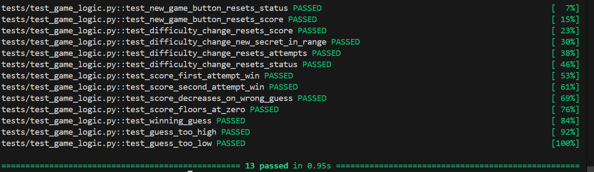

# 🎮 Game Glitch Investigator: The Impossible Guesser

## 🚨 The Situation

You asked an AI to build a simple "Number Guessing Game" using Streamlit.
It wrote the code, ran away, and now the game is unplayable. 

- You can't win.
- The hints lie to you.
- The secret number seems to have commitment issues.

## 🛠️ Setup

1. Install dependencies: `pip install -r requirements.txt`
2. Run the broken app: `python -m streamlit run app.py`

## 🕵️‍♂️ Your Mission

1. **Play the game.** Open the "Developer Debug Info" tab in the app to see the secret number. Try to win.
2. **Find the State Bug.** Why does the secret number change every time you click "Submit"? Ask ChatGPT: *"How do I keep a variable from resetting in Streamlit when I click a button?"*
3. **Fix the Logic.** The hints ("Higher/Lower") are wrong. Fix them.
4. **Refactor & Test.** - Move the logic into `logic_utils.py`.
   - Run `pytest` in your terminal.
   - Keep fixing until all tests pass!

## 📝 Document Your Experience

- [ ] Describe the game's purpose.
This game is a numbe guessing game. There are 3 game difficulties, the range of numbers the secret number can be increase as the difficulty does, and the number of attempt you have decreases. The user will get a score after each game ends.
- [ ] Detail which bugs you found.
The difficulty ranges were swapped, the hint was not accurate, the secret number would be re randomized each time we interacted with the game (ie submitted a guess), the way the score was calculated was incorrect. The "New Game" button didn't work at all, the range of the secret number was hardcoded and was not based on the difficulty chosen, and the text displaying what the secret number was between was also hardcoded. The number of attemps was initialized to 1, so the user had 1 less than intended. Changing the difficulty wouldn't make a new game as it logically should.
- [ ] Explain what fixes you applied.
I moved the 4 functions from app.py into logic_utils.py where they should have been. Swapped the ranges for the difficulties so that the ranges increased along with increase in difficulty. Fixed the hint direction by making it so if the number is higher, it will display "GO Higher", and vice versa. Added a new score formula where the user can get a score between 0-100, based on the formula 100-10*(attempt-1). Fixed the new game button by adding st.session_state.status so that st.stop() would be called upon pressing the button. Changed the hardcoded range of numbers the secret number was based on to be based on the low and high variables from the difficulty mode. Made the initial attempts value 0. To fix changing difficulty not starting a new game, I added a check, if the stored difficulty in session state doesn't match with the currently selected, we reset everything, including a new secret within the new difficulty's range.
## 📸 Demo

- [ ] [Insert a screenshot of your fixed, winning game here]

## 🚀 Stretch Features

- [ ] [If you choose to complete Challenge 4, insert a screenshot of your Enhanced Game UI here]
